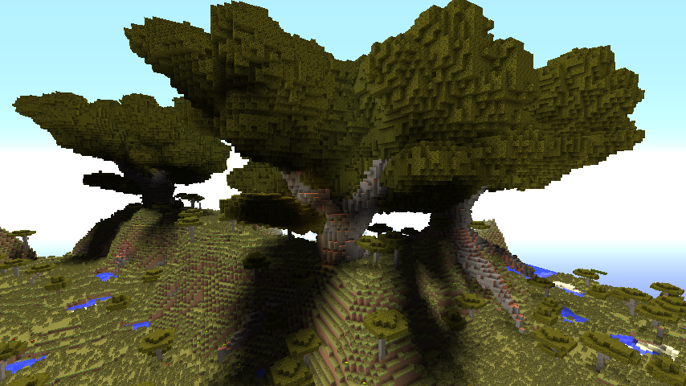
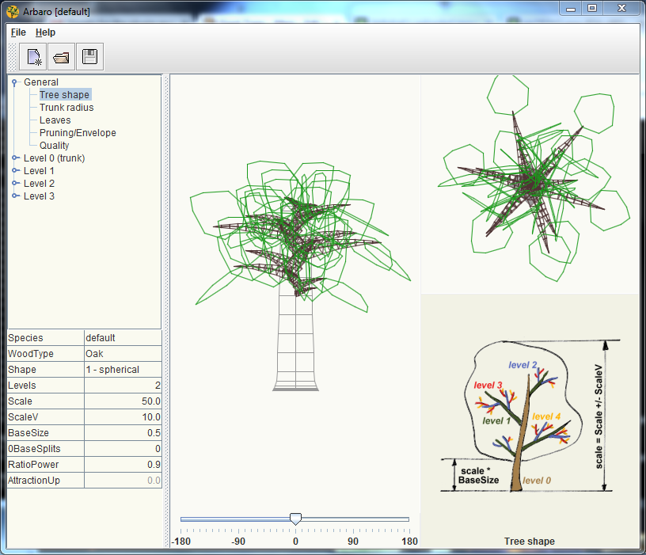

# GiantTrees



Giant Trees is a plugin for adding procedurally generated giant trees to your world. Giant trees are generated in 
three ways:

* Grow trees in creative/survival mode by planting saplings and fertilizing with bone meal
* Summon trees with a command
* Generate trees naturally when new forested biomes spawn

Giant Trees is based on the tree generation algorithm described in Creation and Rendering of Realistic Trees by 
Jason Weber and Joseph Penn as implemented by Wolfram Diestel in Arbaro.

* http://sourceforge.net/projects/arbaro/
* http://ftp.cs.duke.edu/courses/fall02/cps124/resources/p119-weber.pdf

## Planting Giant Trees

To plant a giant tree in creative/survival mode, perform the following steps:

1. Flatten a 5x5 area of dirt
1. Surround an emerald block with two rings of saplings
1. Fertilize a sapling with a stack of 64 bone meal
1. Stand back

The type of sapling fertilized will determine the species of giant tree that grows.


## Commands
To create a giant tree with a command, use the /tree-create or /gt command, followed by the name of the tree. Tree names 
are found in the plugin's data directory. For example, to summon a giant acacia tree, use the command

```
/gt tree.ACACIA
```

To edit the model for an existing tree, or create a new tree model, use the /tree-edit command. This command can only 
be used from the server console.

```
/tree-edit tree.ACACIA
```

## Naturally Growing Trees

By default, Giant Trees will grow naturally in newly generated chunks in the default overworld (the world called 
"world"). To add giant trees to more worlds, increase the frequency of tree growth, or disable natural tree growth
altogether, edit the plugin's config.yml.

## Making Your Own Giant Tree Species

You can make your own species of giant tree. Start by using the /tree-edit command from the server console, giving it
the name of the tree you want to edit or create. (For new trees, ignore the file not found error). As an alternative,
you can double-click the Giant Trees plugin .jar file to start the visual tree editor.



Design your tree using the visual tree editor. When you are done, click save and exit the visual editor. To add roots to
your tree, create another tree with the same name as your tree, with .root added to the end. For example, 
`/tree-edit tree.ACACIA.root`. Root trees are rendered upside down in the world and scaled to match their tree.

# Permissions

* `gianttrees.create` (default OP) - Allows the creation of a giant tree using the tree-create command.
* `gianttrees.grow` (default true) - Allows a player to grow a giant tree by fertilizing a grid of saplings.